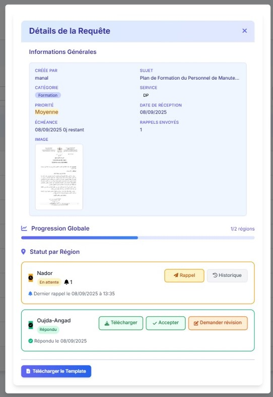
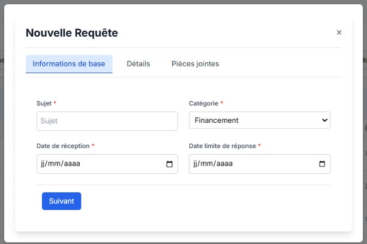
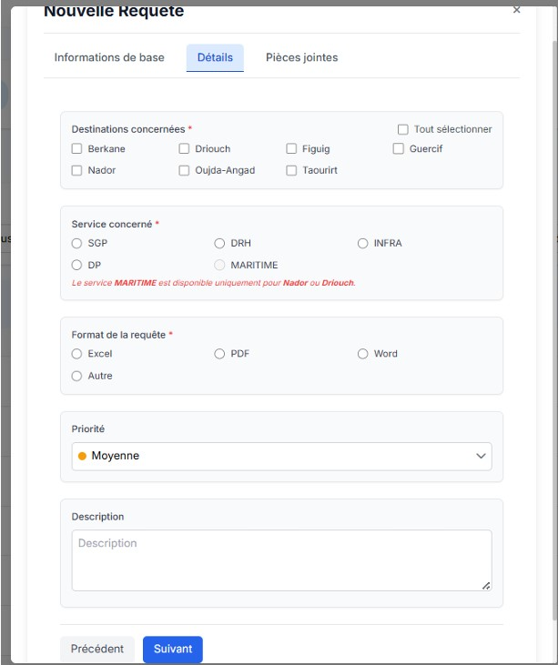
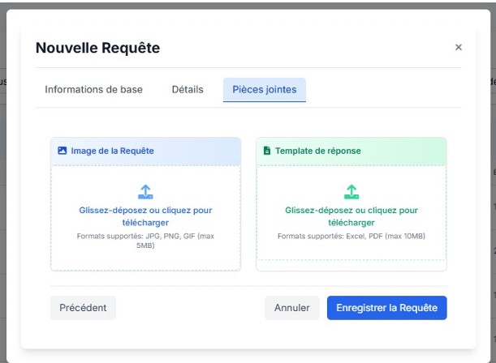
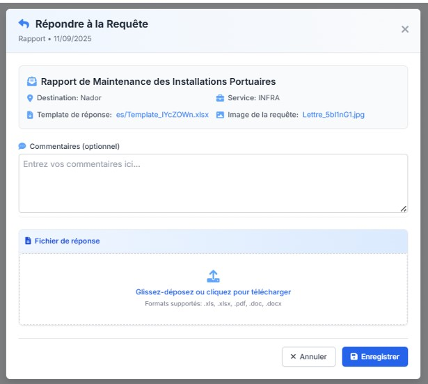
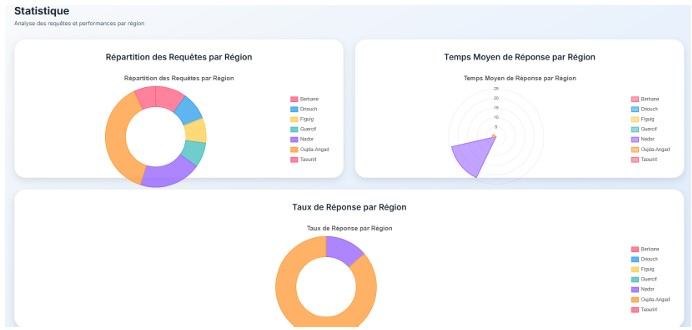

# 📂 RequetManager - Application de Gestion des Requêtes Administratives


> **Projet de Stage d'Été 2025**
> **Organisme :** Direction Régionale de l’Oriental du Ministère de l’Équipement et de l’Eau
> **École :** École Marocaine des Sciences de l’Ingénieur (EMSI) - Ingénierie Informatique et Réseaux

---

## 📝 Description du Projet

**RequetManager** est une application web conçue pour digitaliser et optimiser la gestion des correspondances et des requêtes administratives. Dans un contexte où la gestion manuelle (papier/Excel) montrait ses limites (pertes d'informations, lenteur, manque de traçabilité), cette solution apporte une gestion centralisée, sécurisée et en temps réel.

L'application gère le cycle de vie complet d'une requête : de sa saisie initiale jusqu'à sa réponse validée, en passant par le suivi et l'archivage.

### 🎯 Objectifs
* **Automatisation** des workflows de traitement.
* **Centralisation** des données (requêtes, destinations, réponses).
* **Traçabilité** complète des actions utilisateurs.
* **Reporting** via des tableaux de bord statistiques.

---

## 🛠️ Stack Technique

L'architecture suit le modèle **MVT (Model-View-Template)** de Django.

* **Backend :** Python, Django Framework.
* **Frontend :** HTML5, CSS3, JavaScript.
* **Design & UI :** Tailwind CSS, Bootstrap.
* **Base de Données :** SQLite (Environnement de développement).
* **Outils de Dev :** Cursor IDE, Git.

---

## ✨ Fonctionnalités Clés

L'application est structurée autour de 5 rôles utilisateurs distincts avec des permissions granulaires :

### 1. Gestion des Utilisateurs & Sécurité
* Authentification sécurisée.
* Gestion des rôles : Super Admin, Directeur Régional, Responsable Service DR, Directeur Provincial, Responsable Service DP.

### 2. Workflow de Requêtes
* **Saisie intuitive :** Formulaire en 3 étapes (Infos de base, Configuration opérationnelle, Pièces jointes).
* **Suivi en temps réel :** État d'avancement (En attente, En cours, Traitée).
* **Notifications :** Alertes automatiques pour les nouvelles requêtes et les retards.

### 3. Gestion des Réponses
* Validation hiérarchique des réponses.
* Système de demandes de correction et révisions.
* Génération de templates de réponse.

### 4. Administration & Archivage
* Tableau de bord global avec KPIs (Statistiques, Délais).
* Archivage automatique selon des règles métiers (ex: archivage après 365 jours pour les requêtes sans réponse).

---

## 📸 Aperçu de l'Application

Voici quelques captures d'écran illustrant les principales interfaces de RequetManager.

### Vue d'ensemble et Suivi

| Tableau de Bord Principal | Détails d'une Requête |
|:---:|:---:|
|  |  |
| *Vue globale des statistiques et indicateurs* | *Consultation détaillée et historique* |

### Workflow de Création de Requête (3 Étapes)

| Étape 1 : Informations | Étape 2 : Configuration | Étape 3 : Pièces Jointes |
|:---:|:---:|:---:|
|  |  |  |
| *Saisie des données de base* | *Choix des destinations et priorités* | *Ajout de documents annexes* |

### Traitement et Statistiques

| Interface de Réponse | Tableau de Bord Statistiques |
|:---:|:---:|
|  |  |
| *Formulaire de traitement et validation* | *Analyse des performances* |

---

## 🚀 Installation et Lancement

Pour tester le projet localement, suivez ces étapes :

1.  **Cloner le dépôt :**
    *(Remplacez `votre-username` par votre vrai nom d'utilisateur GitHub)*
    ```bash
    git clone [https://github.com/votre-username/RequetManager.git](https://github.com/votre-username/RequetManager.git)
    cd RequetManager
    ```

2.  **Créer un environnement virtuel :**
    ```bash
    python -m venv venv
    source venv/bin/activate  # Sur Windows : venv\Scripts\activate
    ```

3.  **Installer les dépendances :**
    ```bash
    pip install -r requirements.txt
    ```

4.  **Appliquer les migrations :**
    ```bash
    python manage.py migrate
    ```

5.  **Créer un Super Administrateur :**
    ```bash
    python manage.py createsuperuser
    ```

6.  **Lancer le serveur :**
    ```bash
    python manage.py runserver
    ```

Accédez à l'application via : `http://127.0.0.1:8000/`

---

## 👥 Auteurs et Encadrement

**Réalisé par :**
* **Manal EJJEBLI** - Élève Ingénieur, EMSI Rabat.
* Email : Ejjeblimanal22@gmail.com

**Encadré par :**
* **M. ABDELLAH Ghammouri** (Chef de service de l’administration générale - Direction Régionale de l’Oriental).

---

## 📄 Licence

Ce projet a été réalisé dans un cadre académique et professionnel pour le Ministère de l’Équipement et de l’Eau. Tous droits réservés.
